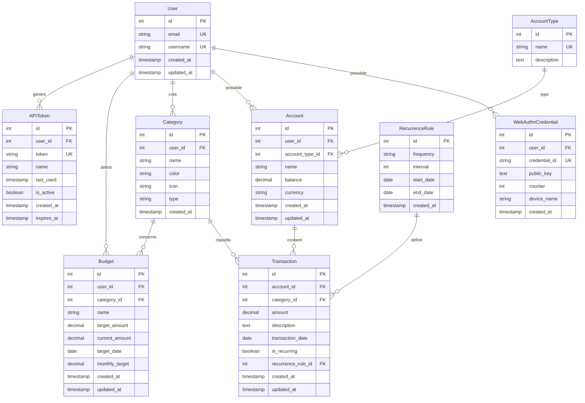

# Modèle de Base de Données - Application de Suivi de Budget

## Vue d'ensemble

Base de données PostgreSQL structurée pour gérer les utilisateurs, comptes bancaires, transactions, budgets et catégories avec leurs relations.

---

## Diagramme ERD (Entity-Relationship Diagram)



---

## Tables détaillées

### 1. User (Utilisateurs)

Stocke les informations des utilisateurs de l'application.

| Colonne     | Type         | Contraintes              | Description                    |
|-------------|--------------|--------------------------|--------------------------------|
| id          | SERIAL       | PRIMARY KEY              | Identifiant unique             |
| email       | VARCHAR(255) | UNIQUE, NOT NULL         | Email de l'utilisateur         |
| username    | VARCHAR(150) | UNIQUE, NOT NULL         | Nom d'utilisateur              |
| created_at  | TIMESTAMP    | NOT NULL, DEFAULT NOW()  | Date de création               |
| updated_at  | TIMESTAMP    | NOT NULL, DEFAULT NOW()  | Date de dernière modification  |

**Index :**
- `idx_user_email` sur `email`
- `idx_user_username` sur `username`

---

### 2. WebAuthnCredential (Passkeys)

Stocke les clés d'authentification WebAuthn pour chaque utilisateur.

| Colonne        | Type         | Contraintes             | Description                        |
|----------------|--------------|-------------------------|------------------------------------|
| id             | SERIAL       | PRIMARY KEY             | Identifiant unique                 |
| user_id        | INTEGER      | FK → User(id), NOT NULL | Référence à l'utilisateur          |
| credential_id  | TEXT         | UNIQUE, NOT NULL        | ID de la credential WebAuthn       |
| public_key     | TEXT         | NOT NULL                | Clé publique encodée               |
| counter        | INTEGER      | NOT NULL, DEFAULT 0     | Compteur anti-replay               |
| device_name    | VARCHAR(100) | NULL                    | Nom du dispositif (optionnel)      |
| created_at     | TIMESTAMP    | NOT NULL, DEFAULT NOW() | Date de création                   |

**Index :**
- `idx_webauthn_user` sur `user_id`
- `idx_webauthn_credential` sur `credential_id`

---

### 3. AccountType (Types de comptes)

Liste prédéfinie des types de comptes bancaires.

| Colonne     | Type         | Contraintes             | Description              |
|-------------|--------------|-------------------------|--------------------------|
| id          | SERIAL       | PRIMARY KEY             | Identifiant unique       |
| name        | VARCHAR(50)  | UNIQUE, NOT NULL        | Nom du type              |
| description | TEXT         | NULL                    | Description du type      |

**Valeurs par défaut :**
- Compte courant
- Compte épargne
- Livret A
- Compte joint
- Autre

---

### 4. Account (Comptes bancaires)

Comptes bancaires de l'utilisateur.

| Colonne          | Type           | Contraintes              | Description                    |
|------------------|----------------|--------------------------|--------------------------------|
| id               | SERIAL         | PRIMARY KEY              | Identifiant unique             |
| user_id          | INTEGER        | FK → User(id), NOT NULL  | Propriétaire du compte         |
| account_type_id  | INTEGER        | FK → AccountType(id)     | Type de compte                 |
| name             | VARCHAR(100)   | NOT NULL                 | Nom personnalisé du compte     |
| balance          | DECIMAL(12, 2) | NOT NULL, DEFAULT 0.00   | Solde actuel                   |
| currency         | VARCHAR(3)     | NOT NULL, DEFAULT 'EUR'  | Code devise (ISO 4217)         |
| created_at       | TIMESTAMP      | NOT NULL, DEFAULT NOW()  | Date de création               |
| updated_at       | TIMESTAMP      | NOT NULL, DEFAULT NOW()  | Date de dernière modification  |

**Index :**
- `idx_account_user` sur `user_id`

**Contraintes :**
- `CHECK (balance >= 0)` optionnel selon besoin

---

### 5. Category (Catégories)

Catégories pour classifier les transactions.

| Colonne    | Type         | Contraintes             | Description                          |
|------------|--------------|-------------------------|--------------------------------------|
| id         | SERIAL       | PRIMARY KEY             | Identifiant unique                   |
| user_id    | INTEGER      | FK → User(id), NOT NULL | Propriétaire (NULL = catégorie globale) |
| name       | VARCHAR(100) | NOT NULL                | Nom de la catégorie                  |
| color      | VARCHAR(7)   | NULL                    | Code couleur hexadécimal (#RRGGBB)   |
| icon       | VARCHAR(50)  | NULL                    | Nom d'icône                          |
| type       | VARCHAR(10)  | NOT NULL                | 'income' ou 'expense'                |
| created_at | TIMESTAMP    | NOT NULL, DEFAULT NOW() | Date de création                     |

**Index :**
- `idx_category_user` sur `user_id`
- `idx_category_type` sur `type`

**Contraintes :**
- `CHECK (type IN ('income', 'expense'))`

**Catégories par défaut (user_id = NULL) :**
- Alimentation, Transport, Logement, Loisirs, Santé, Salaire, etc.

---

### 6. RecurrenceRule (Règles de récurrence)

Définit les règles pour les transactions récurrentes.

| Colonne    | Type         | Contraintes             | Description                             |
|------------|--------------|-------------------------|-----------------------------------------|
| id         | SERIAL       | PRIMARY KEY             | Identifiant unique                      |
| frequency  | VARCHAR(20)  | NOT NULL                | 'daily', 'weekly', 'monthly', 'yearly'  |
| interval   | INTEGER      | NOT NULL, DEFAULT 1     | Intervalle (ex: tous les 2 mois)        |
| start_date | DATE         | NOT NULL                | Date de début                           |
| end_date   | DATE         | NULL                    | Date de fin (NULL = infini)             |
| created_at | TIMESTAMP    | NOT NULL, DEFAULT NOW() | Date de création                        |

**Contraintes :**
- `CHECK (frequency IN ('daily', 'weekly', 'monthly', 'yearly'))`
- `CHECK (interval > 0)`
- `CHECK (end_date IS NULL OR end_date > start_date)`

---

### 7. Transaction (Transactions)

Toutes les transactions financières.

| Colonne              | Type           | Contraintes                 | Description                        |
|----------------------|----------------|-----------------------------|----------------------------------- |
| id                   | SERIAL         | PRIMARY KEY                 | Identifiant unique                 |
| account_id           | INTEGER        | FK → Account(id), NOT NULL  | Compte concerné                    |
| category_id          | INTEGER        | FK → Category(id), NOT NULL | Catégorie                          |
| amount               | DECIMAL(12, 2) | NOT NULL                    | Montant (négatif = dépense)        |
| description          | TEXT           | NULL                        | Description de la transaction      |
| transaction_date     | DATE           | NOT NULL                    | Date de la transaction             |
| is_recurring         | BOOLEAN        | NOT NULL, DEFAULT FALSE     | Transaction récurrente ?           |
| recurrence_rule_id   | INTEGER        | FK → RecurrenceRule(id)     | Règle de récurrence si applicable  |
| created_at           | TIMESTAMP      | NOT NULL, DEFAULT NOW()     | Date de création                   |
| updated_at           | TIMESTAMP      | NOT NULL, DEFAULT NOW()     | Date de dernière modification      |

**Index :**
- `idx_transaction_account` sur `account_id`
- `idx_transaction_category` sur `category_id`
- `idx_transaction_date` sur `transaction_date`
- `idx_transaction_recurring` sur `is_recurring`

**Contraintes :**
- Trigger pour mettre à jour `account.balance` automatiquement

---

### 8. Budget (Budgets)

Objectifs d'épargne ou de dépenses.

| Colonne        | Type           | Contraintes                 | Description                          |
|----------------|----------------|-----------------------------|--------------------------------------|
| id             | SERIAL         | PRIMARY KEY                 | Identifiant unique                   |
| user_id        | INTEGER        | FK → User(id), NOT NULL     | Propriétaire du budget               |
| category_id    | INTEGER        | FK → Category(id), NULL     | Catégorie associée (optionnel)       |
| name           | VARCHAR(100)   | NOT NULL                    | Nom du budget                        |
| target_amount  | DECIMAL(12, 2) | NOT NULL                    | Montant cible                        |
| current_amount | DECIMAL(12, 2) | NOT NULL, DEFAULT 0.00      | Montant actuel épargné               |
| target_date    | DATE           | NULL                        | Date limite pour atteindre l'objectif|
| monthly_target | DECIMAL(12, 2) | NULL                        | Montant mensuel calculé              |
| created_at     | TIMESTAMP      | NOT NULL, DEFAULT NOW()     | Date de création                     |
| updated_at     | TIMESTAMP      | NOT NULL, DEFAULT NOW()     | Date de dernière modification        |

**Index :**
- `idx_budget_user` sur `user_id`
- `idx_budget_category` sur `category_id`

**Contraintes :**
- `CHECK (target_amount > 0)`
- `CHECK (current_amount >= 0)`
- Trigger pour calculer `monthly_target` automatiquement

---

### 9. APIToken (Tokens d'API)

Tokens pour accès API depuis applications mobiles ou externes.

| Colonne    | Type          | Contraintes             | Description                     |
|------------|---------------|-------------------------|---------------------------------|
| id         | SERIAL        | PRIMARY KEY             | Identifiant unique              |
| user_id    | INTEGER       | FK → User(id), NOT NULL | Propriétaire du token           |
| token      | VARCHAR(255)  | UNIQUE, NOT NULL        | Token JWT ou hash               |
| name       | VARCHAR(100)  | NOT NULL                | Nom du token (ex: "Mon iPhone") |
| last_used  | TIMESTAMP     | NULL                    | Dernière utilisation            |
| is_active  | BOOLEAN       | NOT NULL, DEFAULT TRUE  | Token actif ou révoqué          |
| created_at | TIMESTAMP     | NOT NULL, DEFAULT NOW() | Date de création                |
| expires_at | TIMESTAMP     | NULL                    | Date d'expiration (optionnel)   |

**Index :**
- `idx_apitoken_user` sur `user_id`
- `idx_apitoken_token` sur `token`
- `idx_apitoken_active` sur `is_active`

---

## Triggers et fonctions

### 1. Mise à jour automatique du solde de compte

```sql
CREATE OR REPLACE FUNCTION update_account_balance()
RETURNS TRIGGER AS $$
BEGIN
    IF (TG_OP = 'INSERT') THEN
        UPDATE account 
        SET balance = balance + NEW.amount,
            updated_at = NOW()
        WHERE id = NEW.account_id;
        RETURN NEW;
    ELSIF (TG_OP = 'UPDATE') THEN
        UPDATE account 
        SET balance = balance - OLD.amount + NEW.amount,
            updated_at = NOW()
        WHERE id = NEW.account_id;
        RETURN NEW;
    ELSIF (TG_OP = 'DELETE') THEN
        UPDATE account 
        SET balance = balance - OLD.amount,
            updated_at = NOW()
        WHERE id = OLD.account_id;
        RETURN OLD;
    END IF;
END;
$$ LANGUAGE plpgsql;

CREATE TRIGGER trigger_update_account_balance
AFTER INSERT OR UPDATE OR DELETE ON transaction
FOR EACH ROW EXECUTE FUNCTION update_account_balance();
```

### 2. Calcul automatique du montant mensuel pour budgets

```sql
CREATE OR REPLACE FUNCTION calculate_monthly_target()
RETURNS TRIGGER AS $$
DECLARE
    months_remaining INTEGER;
BEGIN
    IF NEW.target_date IS NOT NULL THEN
        months_remaining := EXTRACT(YEAR FROM AGE(NEW.target_date, CURRENT_DATE)) * 12 
                          + EXTRACT(MONTH FROM AGE(NEW.target_date, CURRENT_DATE));
        
        IF months_remaining > 0 THEN
            NEW.monthly_target := (NEW.target_amount - NEW.current_amount) / months_remaining;
        END IF;
    END IF;
    RETURN NEW;
END;
$$ LANGUAGE plpgsql;

CREATE TRIGGER trigger_calculate_monthly_target
BEFORE INSERT OR UPDATE ON budget
FOR EACH ROW EXECUTE FUNCTION calculate_monthly_target();
```

### 3. Mise à jour automatique de updated_at

```sql
CREATE OR REPLACE FUNCTION update_updated_at_column()
RETURNS TRIGGER AS $$
BEGIN
    NEW.updated_at = NOW();
    RETURN NEW;
END;
$$ LANGUAGE plpgsql;

-- Appliquer à toutes les tables avec updated_at
CREATE TRIGGER trigger_update_account_updated_at
BEFORE UPDATE ON account
FOR EACH ROW EXECUTE FUNCTION update_updated_at_column();

CREATE TRIGGER trigger_update_transaction_updated_at
BEFORE UPDATE ON transaction
FOR EACH ROW EXECUTE FUNCTION update_updated_at_column();

CREATE TRIGGER trigger_update_budget_updated_at
BEFORE UPDATE ON budget
FOR EACH ROW EXECUTE FUNCTION update_updated_at_column();

CREATE TRIGGER trigger_update_user_updated_at
BEFORE UPDATE ON "user"
FOR EACH ROW EXECUTE FUNCTION update_updated_at_column();
```

---

## Requêtes courantes

### 1. Obtenir le solde total de tous les comptes d'un utilisateur

```sql
SELECT SUM(balance) as total_balance
FROM account
WHERE user_id = ?;
```

### 2. Obtenir les transactions d'un compte avec pagination

```sql
SELECT t.*, c.name as category_name, c.color as category_color
FROM transaction t
JOIN category c ON t.category_id = c.id
WHERE t.account_id = ?
ORDER BY t.transaction_date DESC, t.created_at DESC
LIMIT 50 OFFSET 0;
```

### 3. Obtenir les dépenses par catégorie pour un mois donné

```sql
SELECT 
    c.name,
    c.color,
    SUM(t.amount) as total_amount,
    COUNT(t.id) as transaction_count
FROM transaction t
JOIN category c ON t.category_id = c.id
JOIN account a ON t.account_id = a.id
WHERE a.user_id = ?
    AND t.amount < 0
    AND EXTRACT(YEAR FROM t.transaction_date) = ?
    AND EXTRACT(MONTH FROM t.transaction_date) = ?
GROUP BY c.id, c.name, c.color
ORDER BY total_amount ASC;
```

### 4. Progression d'un budget

```sql
SELECT 
    b.*,
    c.name as category_name,
    CASE 
        WHEN b.target_amount > 0 
        THEN (b.current_amount / b.target_amount * 100)
        ELSE 0
    END as progress_percentage,
    CASE
        WHEN b.target_date IS NOT NULL
        THEN b.target_date - CURRENT_DATE
        ELSE NULL
    END as days_remaining
FROM budget b
LEFT JOIN category c ON b.category_id = c.id
WHERE b.user_id = ?;
```

### 5. Recherche dans les transactions

```sql
SELECT t.*, c.name as category_name, a.name as account_name
FROM transaction t
JOIN category c ON t.category_id = c.id
JOIN account a ON t.account_id = a.id
WHERE a.user_id = ?
    AND (
        t.description ILIKE '%' || ? || '%'
        OR c.name ILIKE '%' || ? || '%'
        OR CAST(t.amount AS TEXT) LIKE '%' || ? || '%'
    )
ORDER BY t.transaction_date DESC
LIMIT 100;
```

---

## Migrations et versioning

### Stratégie de migration
- Utiliser Django migrations pour gérer les changements de schéma
- Migrations nommées de façon descriptive
- Toujours tester les migrations sur une copie de production
- Garder des migrations backward-compatible quand possible

### Ordre de création des tables
1. `user`
2. `webauthn_credential`
3. `account_type`
4. `category`
5. `account`
6. `recurrence_rule`
7. `transaction`
8. `budget`
9. `apitoken`
10. Triggers et fonctions

---

## Performance et optimisation

### Index recommandés
- Index sur toutes les clés étrangères
- Index composite sur `(account_id, transaction_date)` pour filtrage rapide
- Index sur `user_id` dans toutes les tables utilisateur-dépendantes
- Index partiel sur `is_active = TRUE` pour `apitoken`

### Partitionnement (optionnel pour grande échelle)
- Partitionner `transaction` par année si le volume devient important
- Archivage des anciennes transactions après X années

### Analyse et vacuum
```sql
-- Analyser régulièrement pour optimiser les requêtes
ANALYZE transaction;
ANALYZE account;

-- Vacuum pour récupérer l'espace
VACUUM ANALYZE;
```

---

## Sécurité des données

### Row Level Security (RLS)
Activer RLS pour s'assurer qu'un utilisateur ne peut accéder qu'à ses propres données :

```sql
ALTER TABLE account ENABLE ROW LEVEL SECURITY;
ALTER TABLE transaction ENABLE ROW LEVEL SECURITY;
ALTER TABLE budget ENABLE ROW LEVEL SECURITY;
ALTER TABLE category ENABLE ROW LEVEL SECURITY;

CREATE POLICY account_isolation_policy ON account
    USING (user_id = current_setting('app.current_user_id')::INTEGER);

CREATE POLICY transaction_isolation_policy ON transaction
    USING (account_id IN (
        SELECT id FROM account WHERE user_id = current_setting('app.current_user_id')::INTEGER
    ));
```

### Backup et restauration
- Backup quotidien automatique
- Rétention de 30 jours minimum
- Test de restauration mensuel

---

**Dernière mise à jour : 2026-02-14**
